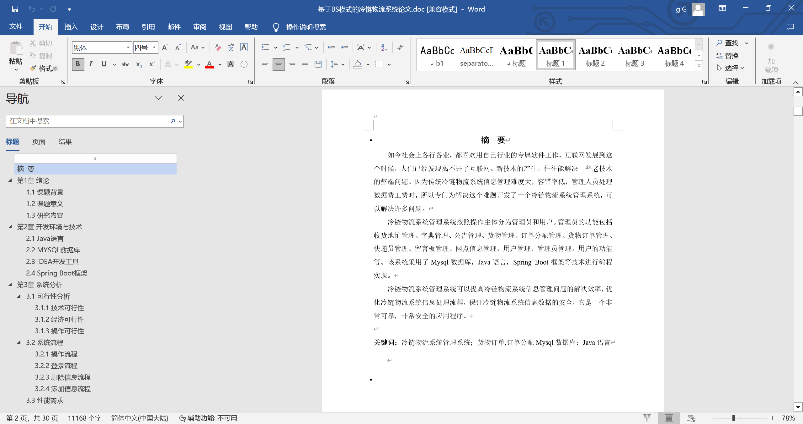
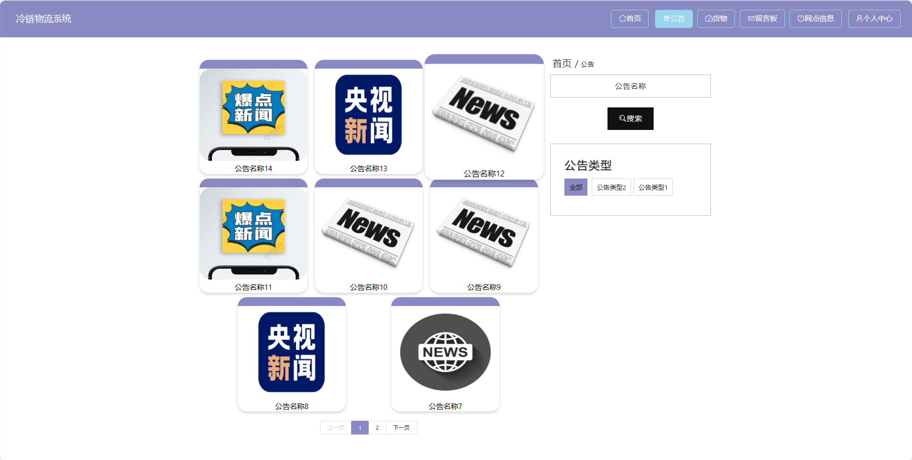
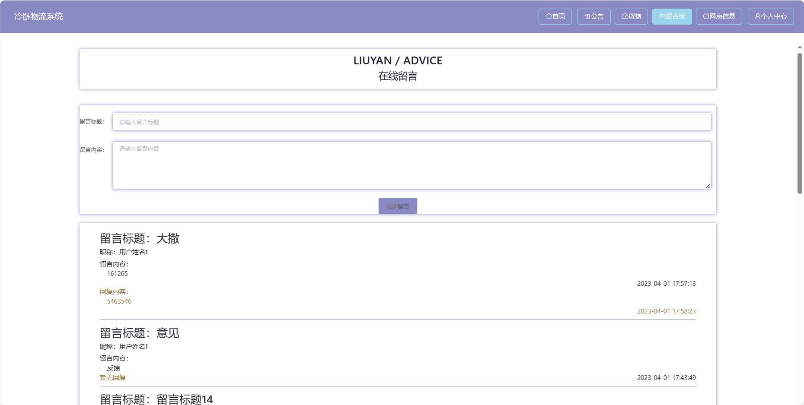
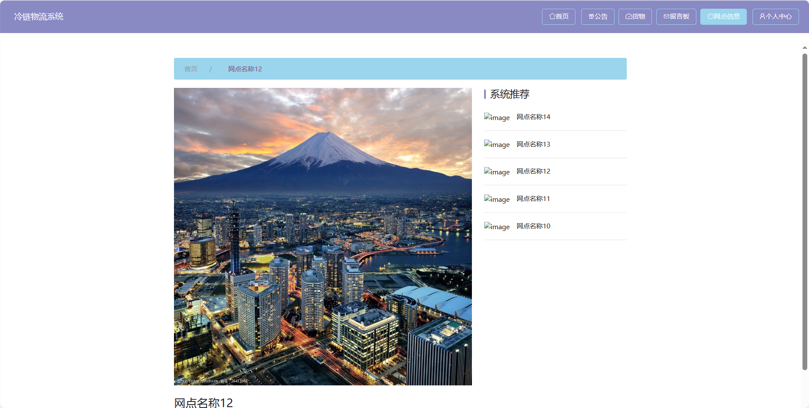
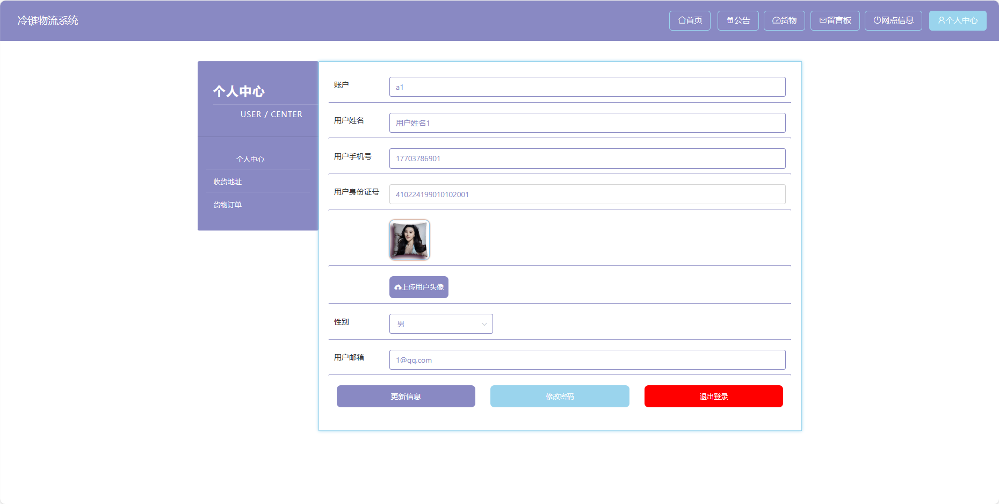

基于Springboot的冷链物流系统（程序+论文）
=
### 完整代码获取地址：从戎源码网 ([https://armycodes.com/](https://armycodes.com/))
### 作者微信：19941326836  QQ：952045282 
### 承接计算机毕业设计、Java毕业设计、Python毕业设计、深度学习、机器学习
### 选题+开题报告+任务书+程序定制+安装调试+论文+答辩ppt 一条龙服务
### 所有选题地址https://github.com/nature924/allProject

一、项目介绍
---
基于Spring Boot框架实现的基于BS模式的冷链物流系统，系统包含三种角色：管理员、用户,快递员,系统分为前台和后台两大模块，主要功能如下。
### 【前台功能】

1. 首页：提供用户进入系统的入口。
2. 公告：用户可以查看系统发布的公告。

3. 货物：用户可以查询货物的实时状态、位置等信息。
4. 留言板：用户可以在留言板上留下对物流服务的意见和建议。
5. 网点信息：提供用户查询物流网点的信息，包括地址、联系方式等。
6. 个人中心：用户可以管理个人信息，查看订单历史、收藏等。

### 【管理员后台功能】

1. 首页：提供管理员进入后台管理的入口。
2. 个人中心：管理员可以管理个人信息。
3. 管理员管理：添加、编辑、删除系统管理员账号。
4. 快递员管理：管理快递员信息。
5. 用户管理：查看、编辑、冻结或删除用户账号。
6. 公告管理：发布、编辑、删除系统公告。
7. 货物管理：查看、编辑、删除货物信息。
8. 订单分配管理：进行订单的分配和调度。
9. 留言板管理：查看用户在留言板上的反馈。
10. 网点信息管理：维护物流网点的信息。
11. 基础数据管理：管理系统的基础数据。
12. 轮播图信息：管理员可以设置首页轮播图。

### 【快递员后台功能】

1. 首页：提供快递员进入后台管理的入口。
2. 个人中心：快递员可以管理个人信息。
3. 公告管理：查看系统发布的公告。
4. 订单分配管理：查看待配送的订单。
5. 留言板管理：查看用户在留言板上的反馈。
6. 网点信息管理：查看所属网点的信息。

二、项目技术
---
- 编程语言：Java
- 数据库：MySQL
- 项目管理工具：Maven
- 前端技术：VUE、HTML、Jquery、Bootstrap
- 后端技术：Spring、SpringMVC、MyBatis

三、运行环境
---
- 操作系统：Windows、macOS都可以
- JDK版本：JDK1.8以上都可以
- 开发工具：IDEA、Ecplise、Myecplise都可以
- 数据库: MySQL5.7以上都可以
- Tomcat：任意版本都可以
- Maven：任意版本都可以

四、运行截图
---
### 论文截图：

### 程序截图：

